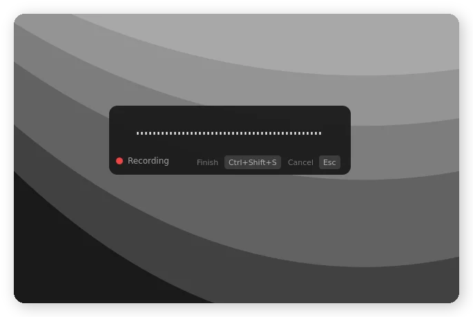
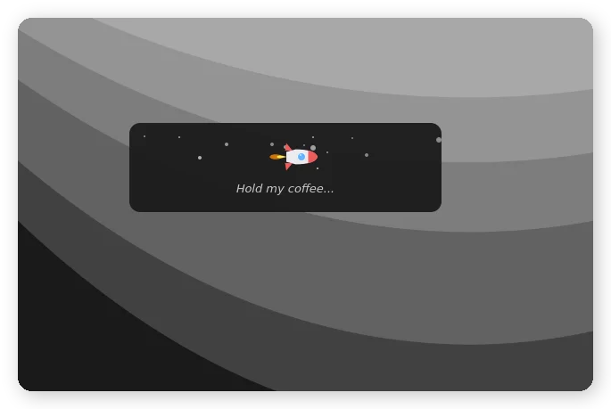
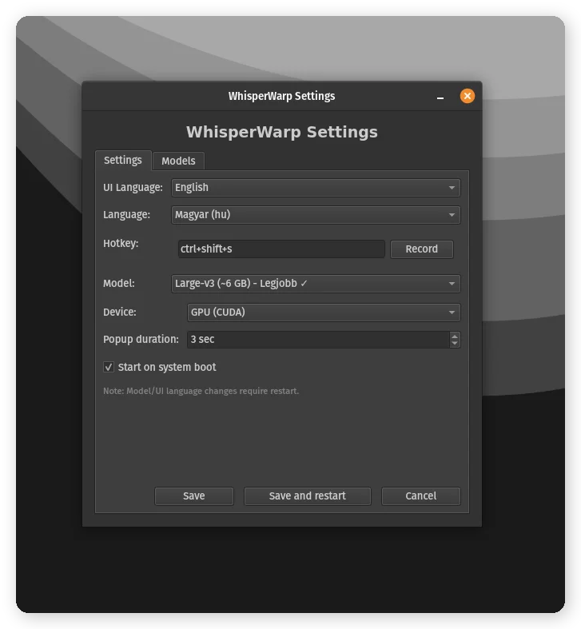
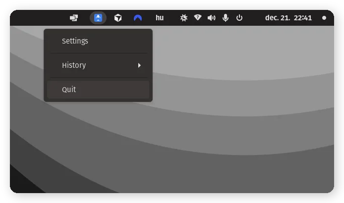

# WhisperRocket

**Silent speech-to-text — Local, fast, private**

WhisperRocket is a desktop application that converts speech to text in real-time using the Whisper AI model. It runs entirely locally on your machine - no cloud services, no API keys, complete privacy.

## Screenshots

<p align="center">
  
  
</p>
<p align="center">
  
  
</p>

## Features

- **Real-time transcription** - Whisper large-v3 model with multi-language support
- **GPU acceleration** - NVIDIA CUDA support for fast processing (CPU fallback available)
- **Global hotkey** - Press Alt+S (configurable) anywhere to start/stop recording
- **Auto-paste** - Transcribed text is automatically pasted into the active window
- **Smart paste detection** - Automatically uses Ctrl+Shift+V for terminals
- **Visual feedback** - Modern popup with equalizer visualization during recording
- **Rocket animation** - Fun animated rocket with witty messages during processing
- **Wayland support** - GTK Layer Shell overlay (experimental, X11 recommended)
- **History** - Browse and copy previous transcriptions from the system tray
- **System tray** - Runs quietly in the background with color-coded status
- **Configurable** - Adjust language, model, hotkey, popup duration, and more

## Requirements

- **OS**: Linux (Ubuntu, Fedora, Arch, openSUSE, and derivatives)
- **Python**: 3.10+
- **GPU**: NVIDIA GPU with CUDA support (recommended) or CPU mode
- **RAM**: 8GB+ (16GB recommended for large-v3 model)

## Installation

### Option A: AppImage (Recommended)

The easiest way to install WhisperRocket - just download and run!

1. Download `WhisperRocket-x86_64.AppImage` from the [Releases](https://github.com/gaborkis11/WhisperRocket/releases) page
2. Make it executable and run:

```bash
chmod +x WhisperRocket-x86_64.AppImage
./WhisperRocket-x86_64.AppImage
```

On first run, the application will:
- Detect your GPU (NVIDIA/CPU)
- Download CUDA libraries if needed (~900MB for NVIDIA users)
- Download the Whisper model of your choice

### Option B: Install from Source

For developers or if you prefer a traditional installation:

#### 1. Clone the repository

```bash
git clone https://github.com/gaborkis11/WhisperRocket.git
cd WhisperRocket
```

#### 2. Run the installer

```bash
chmod +x install.sh
./install.sh
```

The installer automatically:
- ✅ Detects your Linux distribution (Ubuntu, Fedora, Arch, openSUSE)
- ✅ Detects your GPU (NVIDIA CUDA / AMD / Intel / CPU-only)
- ✅ Installs all required system packages
- ✅ Creates Python virtual environment
- ✅ Installs Python dependencies (CUDA packages only if NVIDIA detected)
- ✅ Configures the application for your hardware
- ✅ Adds WhisperRocket to your application menu

### 3. Start the application

```bash
./start.sh
```

Or launch "WhisperRocket" from your application menu.

> **Note for NVIDIA users**: After installation, open a new terminal or run `source ~/.bashrc` before starting the application.

## GPU Support

| GPU Type | Mode | Performance |
|----------|------|-------------|
| NVIDIA (CUDA) | GPU accelerated | ⚡ Fast (~1-2s for 30s audio) |
| AMD / Intel | CPU fallback | 🐢 Slower (~10-15s for 30s audio) |
| No GPU | CPU mode | 🐢 Slower |

## Usage

1. **Start recording**: Press `Alt+S` (or your configured hotkey)
2. **Speak**: The popup shows an equalizer while recording
3. **Stop recording**: Press `Alt+S` again
4. **Processing**: Watch the rocket animation while Whisper transcribes
5. **Done**: Text is automatically pasted and shown in the popup

### Keyboard Shortcuts

| Key | Action |
|-----|--------|
| Alt+S | Start/Stop recording |
| Escape | Cancel recording (discard) |

### System Tray Colors

| Color | Status |
|-------|--------|
| 🔵 Blue | Ready |
| 🔴 Red | Recording |
| 🟡 Yellow | Processing |
| 🟢 Green | Done (text copied) |

### History

Right-click the tray icon → **History** to:
- Browse previous transcriptions
- Click any entry to view full text
- Copy text to clipboard
- Clear history

History is stored locally (~/.config/whisperrocket/history.json) with a 100MB limit.

## Configuration

Right-click the tray icon → **Settings** to configure:

- **Language** - Transcription language (Hungarian, English, German, etc.)
- **Hotkey** - Global shortcut key
- **UI Language** - Interface language (English, Hungarian)
- **Model** - Whisper model size (tiny, base, small, medium, large-v3-turbo, large-v3)
- **Device** - GPU (CUDA) or CPU
- **Popup duration** - How long the result popup stays visible (1-30 seconds)
- **Autostart** - Launch on system startup

Configuration is stored in `config.json`.

## Dependencies

- [faster-whisper](https://github.com/guillaumekln/faster-whisper) - Optimized Whisper implementation
- [PySide6](https://wiki.qt.io/Qt_for_Python) - GUI framework (LGPL license)
- [sounddevice](https://python-sounddevice.readthedocs.io/) - Audio recording
- [pynput](https://pynput.readthedocs.io/) - Global hotkey handling
- [pyperclip](https://pyperclip.readthedocs.io/) - Clipboard operations
- [GTK Layer Shell](https://github.com/wmww/gtk-layer-shell) - Wayland overlay support
- [PyGObject](https://pygobject.readthedocs.io/) - GTK Python bindings (Wayland)

## Project Structure

```
WhisperRocket/
├── whisper_gui.py        # Main application
├── popup_window.py       # Popup window for X11 (equalizer, rocket, text)
├── wayland_overlay.py    # Wayland popup (GTK Layer Shell, no focus steal)
├── settings_window.py    # Settings dialog
├── about_window.py       # About dialog
├── history_manager.py    # History storage and management
├── history_viewer.py     # History entry viewer window
├── model_manager.py      # Whisper model management
├── download_manager.py   # Model download handling
├── cuda_manager.py       # CUDA runtime download (AppImage)
├── translations.py       # Multi-language UI support (EN/HU)
├── platform_support/     # Platform abstraction layer
│   ├── base.py           # Abstract interface
│   ├── linux.py          # Linux-specific implementation
│   └── utils.py          # Platform detection
├── packaging/            # AppImage build files
│   ├── build_appimage.sh # Build script
│   ├── AppRun            # AppImage entry point
│   └── whisperrocket.spec # PyInstaller config
├── config.json           # User configuration
├── start.sh              # Startup script
├── install.sh            # Installation script
├── uninstall.sh          # Uninstallation script
├── requirements.txt      # Python dependencies
├── requirements-cuda.txt # NVIDIA CUDA dependencies
└── assets/               # Icons and sounds
```

## Supported Distributions

The installer has been tested on:
- Ubuntu 22.04+ / Linux Mint / Pop!_OS
- Fedora 38+
- Arch Linux / Manjaro
- openSUSE Tumbleweed

### Tested Platforms

| Distribution | Display Server | Status |
|--------------|----------------|--------|
| Pop!_OS | X11 | ✅ Fully working |
| Linux Mint | X11 | ✅ Fully working |
| Pop!_OS | Wayland (COSMIC) | ⚠️ Experimental |
| GNOME | Wayland | ⚠️ Experimental |
| KDE Plasma | Wayland | ⚠️ Experimental |

## Troubleshooting

### No audio input
- Check your microphone permissions
- Verify the correct input device in system settings

### Slow transcription
- Ensure CUDA is properly installed (NVIDIA only)
- Use a smaller model (small or medium) for faster results
- Check that GPU mode is enabled in settings

### Hotkey not working
- Some desktop environments require accessibility permissions
- Try running with `sudo` once to register the hotkey

### Wayland compatibility
WhisperRocket has **experimental Wayland support**:
- ✅ GTK Layer Shell popup that doesn't steal focus
- ✅ Native evdev hotkey detection (no X11 required)
- ✅ Auto-paste via `wtype` (Wayland) or `xdotool` (X11)

> ⚠️ **Warning**: Wayland support is experimental. Due to Wayland's stricter security model, some features may not work reliably on all desktop environments. For the best experience, **X11 is recommended**. Full functionality is not guaranteed on Wayland.

**Note for Wayland users**: Add your user to the `input` group for hotkey support:
```bash
sudo usermod -a -G input $USER
```
Then log out and back in.

## Uninstall

### AppImage
Run the uninstaller:
```bash
./WhisperRocket-x86_64.AppImage --uninstall
```

Or manually delete user data:
```bash
rm -rf ~/.config/whisperrocket
rm -rf ~/.cache/huggingface/hub/whisperrocket_models
rm -rf ~/.local/share/whisperrocket
```
Then delete the AppImage file itself.

### Source Installation
Run the uninstaller from the project directory:
```bash
cd WhisperRocket
./uninstall.sh
```

The uninstaller offers three options:
- **Quick uninstall**: Removes launcher and venv (keeps config and models)
- **Full uninstall**: Removes everything including downloaded models
- **Custom**: Choose what to remove

## License

**Source Available License** - Free for personal, non-commercial use only.

You MAY:
- ✅ Use for personal purposes
- ✅ View and study the source code
- ✅ Report bugs and suggest features

You MAY NOT:
- ❌ Sell or distribute for payment
- ❌ Use commercially
- ❌ Create competing products

See [LICENSE](LICENSE) for full details. For commercial licensing, contact the author.

## Acknowledgments

- [OpenAI Whisper](https://github.com/openai/whisper) - The amazing speech recognition model
- [faster-whisper](https://github.com/guillaumekln/faster-whisper) - CTranslate2-based Whisper implementation
