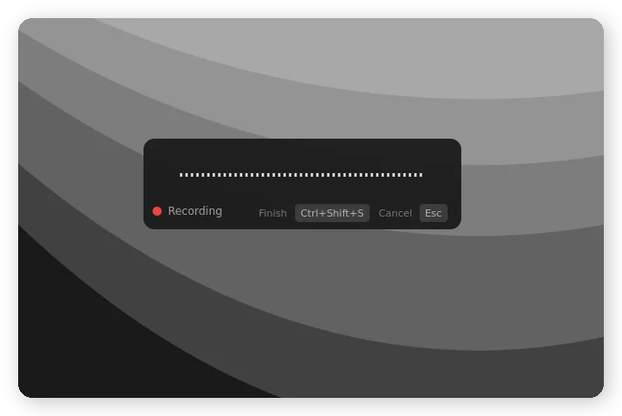
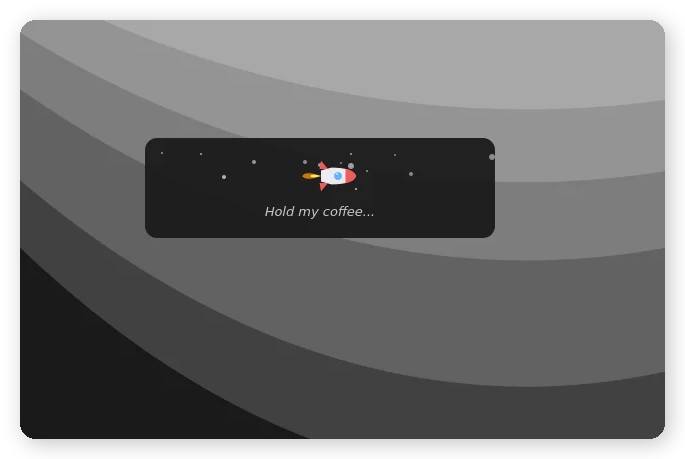
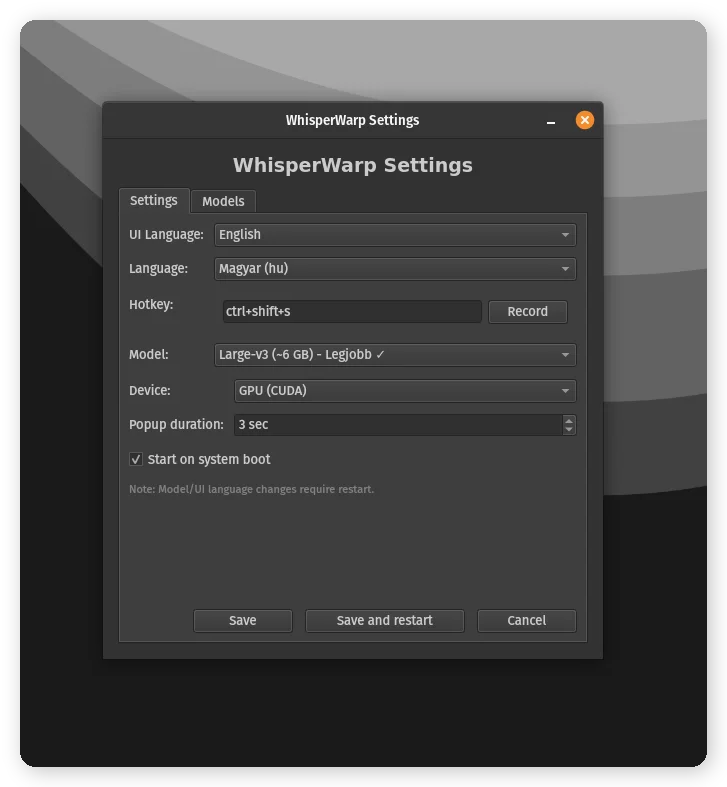
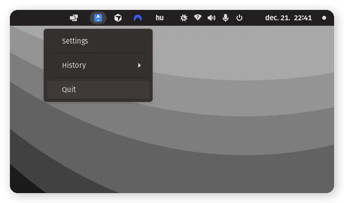

# WhisperRocket

**Silent speech-to-text — Local, fast, private**

WhisperRocket is a desktop application that converts speech to text in real-time using the Whisper AI model. It runs entirely locally on your machine - no cloud services, no API keys, complete privacy.

## Screenshots

<p align="center">
  
  
</p>
<p align="center">
  
  
</p>

## Features

- **Real-time transcription** - Whisper large-v3 model with multi-language support (including Hungarian-optimized model)
- **GPU acceleration** - NVIDIA CUDA support for fast processing (CPU fallback available)
- **Global hotkey** - Press Alt+S (configurable) anywhere to start/stop recording
- **Auto-paste** - Transcribed text is automatically pasted into the active window
- **Smart paste detection** - Automatically uses Ctrl+Shift+V for terminals
- **Visual feedback** - Modern popup with equalizer visualization during recording
- **Rocket animation** - Fun animated rocket with witty messages during processing
- **Wayland support** - GTK Layer Shell overlay (experimental, X11 recommended)
- **File transcription** - Transcribe audio/video files (meetings, interviews, podcasts) with drag & drop
- **Speaker diarization** - Identify who is speaking (optional, via [pyannote-audio](https://github.com/pyannote/pyannote-audio))
- **Export** - Save transcriptions as SRT, VTT, TXT, or JSON
- **AI cleanup** - Optionally turn the raw transcript into a finished message in your own style, using your own Claude subscription (see [AI cleanup](#ai-cleanup-optional))
- **History** - Browse and copy previous transcriptions from the system tray
- **System tray** - Runs quietly in the background with color-coded status
- **Configurable** - Adjust language, model, hotkey, popup duration, and more

## Requirements

- **OS**: Linux (Ubuntu, Fedora, Arch, openSUSE, and derivatives)
- **Python**: 3.10+
- **GPU**: NVIDIA GPU with CUDA support (recommended) or CPU mode
- **RAM**: 8GB+ (16GB recommended for large-v3 model)

## Installation

### Option A: AppImage (Recommended)

The easiest way to install WhisperRocket - just download and run!

1. Download `WhisperRocket-x86_64.AppImage` from the [Releases](https://github.com/gaborkis11/WhisperRocket/releases) page
2. Make it executable and run:

```bash
chmod +x WhisperRocket-x86_64.AppImage
./WhisperRocket-x86_64.AppImage
```

On first run, the application will:
- Detect your GPU (NVIDIA/CPU)
- Download CUDA libraries if needed (~900MB for NVIDIA users)
- Download the Whisper model of your choice

### Option B: Install from Source

For developers or if you prefer a traditional installation:

#### 1. Clone the repository

```bash
git clone https://github.com/gaborkis11/WhisperRocket.git
cd WhisperRocket
```

#### 2. Run the installer

```bash
chmod +x install.sh
./install.sh
```

The installer automatically:
- ✅ Detects your Linux distribution (Ubuntu, Fedora, Arch, openSUSE)
- ✅ Detects your GPU (NVIDIA CUDA / AMD / Intel / CPU-only)
- ✅ Installs all required system packages
- ✅ Creates Python virtual environment
- ✅ Installs Python dependencies (CUDA packages only if NVIDIA detected)
- ✅ Configures the application for your hardware
- ✅ Adds WhisperRocket to your application menu

### 3. Start the application

```bash
./start.sh
```

Or launch "WhisperRocket" from your application menu.

> **Note for NVIDIA users**: After installation, open a new terminal or run `source ~/.bashrc` before starting the application.

## GPU Support

| GPU Type | Mode | Performance |
|----------|------|-------------|
| NVIDIA (CUDA) | GPU accelerated | ⚡ Fast (~1-2s for 30s audio) |
| AMD / Intel | CPU fallback | 🐢 Slower (~10-15s for 30s audio) |
| No GPU | CPU mode | 🐢 Slower |

## Usage

1. **Start recording**: Press `Alt+S` (or your configured hotkey)
2. **Speak**: The popup shows an equalizer while recording
3. **Stop recording**: Press `Alt+S` again
4. **Processing**: Watch the rocket animation while Whisper transcribes
5. **Done**: Text is automatically pasted and shown in the popup

### Keyboard Shortcuts

| Key | Action |
|-----|--------|
| Alt+S | Start/Stop recording |
| Escape | Cancel recording (discard) |

### System Tray Colors

| Color | Status |
|-------|--------|
| 🔵 Blue | Ready |
| 🔴 Red | Recording |
| 🟡 Yellow | Processing |
| 🟢 Green | Done (text copied) |

### History

Right-click the tray icon → **History** to:
- Browse previous transcriptions
- Click any entry to view full text
- Copy text to clipboard
- Clear history

History is stored locally (~/.config/whisperrocket/history.json) with a 100MB limit.

### File Transcription

Right-click the tray icon → **File Transcription** to transcribe audio/video files:

1. **Load file**: Drag & drop or click Browse (supports WAV, MP3, M4A, FLAC, OGG, MP4, MKV, WEBM)
2. **Configure**: Select language, enable/disable VAD filter and speaker diarization
3. **Transcribe**: Click "Start Transcription" — segments appear in real-time with timestamps
4. **Export**: Save as SRT (subtitles), VTT (web subtitles), TXT (timestamped text), or JSON (structured)

Performance with CUDA GPU: ~3-8 min for a 1-hour recording.

### Speaker Diarization (optional)

Speaker diarization identifies who is speaking in a recording. It uses [pyannote-audio](https://github.com/pyannote/pyannote-audio) (MIT license) and requires a free [HuggingFace](https://huggingface.co) account.

**Setup via the app:**

Click the **"Setup..."** button next to the "Speaker diarization" checkbox. The app guides you through:
1. Installing pyannote-audio
2. Creating a HuggingFace token (select **Read** type)
3. Accepting the model licenses (both [speaker-diarization-3.1](https://huggingface.co/pyannote/speaker-diarization-3.1) and [segmentation-3.0](https://huggingface.co/pyannote/segmentation-3.0))
4. Pasting the token into the app

**Manual setup:**
```bash
# 1. Install pyannote-audio
./venv/bin/pip install pyannote-audio

# 2. Accept model licenses on HuggingFace (requires login):
#    - https://huggingface.co/pyannote/speaker-diarization-3.1
#    - https://huggingface.co/pyannote/segmentation-3.0
#    - https://huggingface.co/pyannote/speaker-diarization-community-1

# 3. The app will ask for your HuggingFace token on first use
#    (or set it yourself, see below)
```

**Where the token is stored:**

The token is written to `~/.config/whisperrocket/.env` with `0600` permissions
(readable only by you). It is never written into `config.json`, so it cannot end
up in a git commit.

You can also supply it as an environment variable instead — an exported value
always takes precedence over the stored one:

```bash
export HF_TOKEN="hf_..."
./start.sh
```

### AI cleanup (optional)

Raw speech-to-text is faithful but messy: no punctuation, filler words, half-started
sentences, and the occasional misheard name. AI cleanup turns the transcript into the
message you actually meant to send — in *your* voice, not a chatbot's.

It runs through **your own Claude Code CLI and your own Claude subscription**. There is
no API key to buy, no account to create with us, and nothing is billed to anyone but you.

**Off by default.** With it switched off, dictation behaves exactly as it always has.

#### Two modes

| Mode | When | What it does |
|------|------|--------------|
| **Transcript** (default) | Always | Fixes punctuation, capitalisation and spelling, deletes filler words and stutters, repairs obvious misrecognitions. Changes nothing else. |
| **Compose** | You start dictating with a trigger phrase | Writes the message from what you described, instead of transcribing it literally. |

The trigger phrase is configurable (Settings → AI → Compose mode). A phrase is used
rather than a button so you can switch modes without touching anything.

#### Your swearing is not touched

This is a design requirement, not a side effect. If you swore, the same word appears in
the output, spelled out in full. The cleanup is instructed never to soften it, **and the
output is checked afterwards** — if the model substitutes, censors or drops a swear word,
the response is thrown away and the plain transcript is used instead.

The same check catches the other ways a model can quietly betray a transcript: swapping
who is speaking and who is being addressed, summarising instead of tidying, inventing a
sentence, or answering with commentary rather than the message. Every one of those was
observed in testing before the check existed.

#### Nothing is ever lost

Every failure path — CLI missing, not signed in, usage limit reached, timeout, no
network, or a response the guard rejects — falls back to the plain transcript and marks
the tray icon orange with the reason. You always get your text.

#### Setup

Everything happens in **Settings → AI**; you never need a terminal.

1. **Install Claude Code** — if the CLI is missing, the tab offers to run Anthropic's
   [official installer](https://code.claude.com/docs/en/setup). It shows the exact
   command and asks first.
2. **Sign in** — opens Anthropic's own browser sign-in flow.
3. **Enable AI cleanup** — and optionally pick a model (Sonnet by default).

Requires a Claude Pro, Max, Team or Enterprise plan. Usage counts against that plan's
limits, shared with everything else you do with Claude. A dictation costs roughly 700
input and 150 output tokens.

> **Credentials.** WhisperRocket never sees, stores or transports your Claude login.
> Sign-in is delegated to `claude auth login`, which completes entirely through
> Anthropic's own flow and stores the credential in Claude Code's own store; the app
> only reads `claude auth status` to show whether you are signed in. There is no field
> to paste a token into, by design — Anthropic's
> [policy](https://code.claude.com/docs/en/legal-and-compliance) requires that
> third-party applications not collect or intermediate Claude account credentials, and
> permits an end user to sign in to the unmodified Claude Code binary with their own
> subscription. That is exactly the path taken here, which is also why the CLI is
> installed from Anthropic's own installer rather than bundled.

#### Where your personal settings live

Everything personal — style profile, custom dictionary, edited prompts, history and
your settings — lives in one folder **outside this repository**:

```
~/.config/whisperrocket/
```

That location is the privacy design, not a convention. Git cannot see those files even
in principle, because they are not inside the working tree. `.gitignore` and the
[pre-commit hook](#files-and-secrets) are the second and third lines of defence, for a
copy that ends up in the project directory during development.

Settings → AI shows the path with an **Open folder** button. To move your setup to
another machine, copy that one folder.

#### Style profile

A short description of how you write — sentence length, whether you greet, how you mix
languages, how you swear. Without one the cleanup still works but sounds generic.

Copy [`style_profile.example.md`](style_profile.example.md) to
`~/.config/whisperrocket/style_profile.md`, or click **Edit** in the AI tab to have the
template seeded for you. Keep it to aggregate traits, never real messages. It is
gitignored and never committed.

#### Custom dictionary

Speech recognition reliably mangles the proper nouns *you* use. The dictionary fixes them
in code, before the model sees the text — no tokens, no guessing, and it works with AI
cleanup switched off entirely.

`high` confidence entries are replaced automatically; `low` ones are passed to the model
as a hint so context can decide. See
[`dictionary.example.json`](dictionary.example.json) for the format.

## Configuration

Right-click the tray icon → **Settings** to configure:

- **Language** - Transcription language (Hungarian, English, German, etc.)
- **Hotkey** - Global shortcut key
- **UI Language** - Interface language (English, Hungarian)
- **Model** - Whisper model size (tiny, base, small, medium, large-v3-turbo, large-v3, large-v3-hu)
- **Device** - GPU (CUDA) or CPU
- **Popup duration** - How long the result popup stays visible (1-30 seconds)
- **Autostart** - Launch on system startup

### Files and secrets

| What | Where | In git? |
|------|-------|---------|
| Settings | `config.json` (source install) / `~/.config/whisperrocket/config.json` (AppImage) | No — gitignored |
| Settings template | `config.example.json` | Yes |
| API tokens | `~/.config/whisperrocket/.env` (mode `0600`) | Never |
| History | `~/.config/whisperrocket/history.json` | No |
| Style profile | `~/.config/whisperrocket/style_profile.md` | Never |
| Custom dictionary | `~/.config/whisperrocket/dictionary.json` | Never |
| Edited AI prompts | `~/.config/whisperrocket/prompt_{transcript,compose}.md` | Never |
| Style / dictionary templates | `style_profile.example.md`, `dictionary.example.json` | Yes |
| Claude login | Managed by Claude Code itself — WhisperRocket never stores it | Never |

`config.json` is generated by `install.sh` based on your detected GPU — copy
`config.example.json` over it if you ever need to start fresh.

**Secrets never belong in `config.json` or any other tracked file.** They are
read through `secrets_manager.py`, which checks real environment variables first
and falls back to `~/.config/whisperrocket/.env`.

If you are contributing, enable the secret-scanning hook once per clone:

```bash
git config core.hooksPath .githooks
```

It blocks commits containing API-token-shaped strings, a staged `.env` file, or
personal settings (`style_profile.md`, `dictionary.json`, `prompt_*.md`,
`config.json`, `history.json`). `.gitignore` already covers those, but `git add -f`
bypasses it — the hook is the second line of defence. The `.example` templates are
the versions meant to ship.

> **Upgrading from an earlier version?** `config.json` used to be tracked in
> this repository. If `git pull` complains about it, run
> `git rm --cached config.json` (or `git stash`) first — your local settings are
> kept, and any HuggingFace token still inside it is migrated to `.env`
> automatically on the next start.

### Hungarian-optimized model (Large-v3-hu)

WhisperRocket includes support for the [Trendency/whisper-large-v3-hu](https://huggingface.co/Trendency/whisper-large-v3-hu) model, which is fine-tuned for Hungarian speech recognition. This model requires a one-time conversion to CTranslate2 format.

To use it:
1. Install conversion dependencies:
   ```bash
   ./venv/bin/pip install torch transformers
   ```
2. Select **Large-v3-hu** in Settings → Model
3. The app will download and convert the model automatically (~6 GB download, ~5-15 min conversion)
4. After conversion, you can optionally remove the conversion dependencies to save ~3 GB:
   ```bash
   ./venv/bin/pip uninstall torch transformers -y
   ```

## Dependencies

- [faster-whisper](https://github.com/guillaumekln/faster-whisper) - Optimized Whisper implementation
- [PySide6](https://wiki.qt.io/Qt_for_Python) - GUI framework (LGPL license)
- [sounddevice](https://python-sounddevice.readthedocs.io/) - Audio recording
- [pynput](https://pynput.readthedocs.io/) - Global hotkey handling
- [pyperclip](https://pyperclip.readthedocs.io/) - Clipboard operations
- [GTK Layer Shell](https://github.com/wmww/gtk-layer-shell) - Wayland overlay support
- [PyGObject](https://pygobject.readthedocs.io/) - GTK Python bindings (Wayland)
- [pyannote-audio](https://github.com/pyannote/pyannote-audio) - Speaker diarization (optional, MIT license)

## Project Structure

```
WhisperRocket/
├── whisper_gui.py        # Main application
├── popup_window.py       # Popup window for X11 (equalizer, rocket, text)
├── wayland_overlay.py    # Wayland popup (GTK Layer Shell, no focus steal)
├── settings_window.py    # Settings dialog
├── about_window.py       # About dialog
├── history_manager.py    # History storage and management
├── history_viewer.py     # History entry viewer window
├── model_manager.py      # Whisper model management
├── download_manager.py   # Model download handling
├── cuda_manager.py       # CUDA runtime download (AppImage)
├── file_transcription_window.py  # File transcription UI
├── transcription_engine.py       # Transcription backend & export
├── diarization_manager.py        # Speaker diarization (pyannote)
├── ai_enhancer.py        # AI cleanup pipeline (prompt, Claude call, modes)
├── ai_guard.py           # Rejects model output that betrays the transcript
├── claude_cli.py         # Claude Code CLI wrapper (install, sign-in status)
├── dictionary_manager.py # Custom dictionary for misheard proper nouns
├── translations.py       # Multi-language UI support (EN/HU)
├── config_paths.py       # Config file location (dev vs bundled)
├── secrets_manager.py    # API token storage (~/.config/whisperrocket/.env)
├── platform_support/     # Platform abstraction layer
│   ├── base.py           # Abstract interface
│   ├── linux.py          # Linux-specific implementation
│   └── utils.py          # Platform detection
├── packaging/            # AppImage build files
│   ├── build_appimage.sh # Build script
│   ├── AppRun            # AppImage entry point
│   └── whisperrocket.spec # PyInstaller config
├── config.example.json   # Configuration template
├── style_profile.example.md   # Style profile template for AI cleanup
├── dictionary.example.json    # Custom dictionary template
├── .githooks/            # Opt-in secret-scanning pre-commit hook
├── start.sh              # Startup script
├── install.sh            # Installation script
├── uninstall.sh          # Uninstallation script
├── requirements.txt      # Python dependencies
├── requirements-cuda.txt # NVIDIA CUDA dependencies
└── assets/               # Icons and sounds
```

## Supported Distributions

The installer has been tested on:
- Ubuntu 22.04+ / Linux Mint / Pop!_OS
- Fedora 38+
- Arch Linux / Manjaro
- openSUSE Tumbleweed

### Tested Platforms

| Distribution | Display Server | Status |
|--------------|----------------|--------|
| Pop!_OS | X11 | ✅ Fully working |
| Linux Mint | X11 | ✅ Fully working |
| Pop!_OS | Wayland (COSMIC) | ⚠️ Experimental |
| GNOME | Wayland | ⚠️ Experimental |
| KDE Plasma | Wayland | ⚠️ Experimental |

## Troubleshooting

### No audio input
- Check your microphone permissions
- Verify the correct input device in system settings

### Slow transcription
- Ensure CUDA is properly installed (NVIDIA only)
- Use a smaller model (small or medium) for faster results
- Check that GPU mode is enabled in settings

### Hotkey not working
- Some desktop environments require accessibility permissions
- Try running with `sudo` once to register the hotkey

### Wayland compatibility
WhisperRocket has **experimental Wayland support**:
- ✅ GTK Layer Shell popup that doesn't steal focus
- ✅ Native evdev hotkey detection (no X11 required)
- ✅ Auto-paste via `wtype` (Wayland) or `xdotool` (X11)

> ⚠️ **Warning**: Wayland support is experimental. Due to Wayland's stricter security model, some features may not work reliably on all desktop environments. For the best experience, **X11 is recommended**. Full functionality is not guaranteed on Wayland.

**Note for Wayland users**: Add your user to the `input` group for hotkey support:
```bash
sudo usermod -a -G input $USER
```
Then log out and back in.

## Uninstall

### AppImage
Run the uninstaller:
```bash
./WhisperRocket-x86_64.AppImage --uninstall
```

Or manually delete user data:
```bash
rm -rf ~/.config/whisperrocket
rm -rf ~/.cache/huggingface/hub/whisperrocket_models
rm -rf ~/.local/share/whisperrocket
```
Then delete the AppImage file itself.

### Source Installation
Run the uninstaller from the project directory:
```bash
cd WhisperRocket
./uninstall.sh
```

The uninstaller offers three options:
- **Quick uninstall**: Removes launcher and venv (keeps config and models)
- **Full uninstall**: Removes everything including downloaded models
- **Custom**: Choose what to remove

## License

**Source Available License** - Free for personal, non-commercial use only.

You MAY:
- ✅ Use for personal purposes
- ✅ View and study the source code
- ✅ Report bugs and suggest features

You MAY NOT:
- ❌ Sell or distribute for payment
- ❌ Use commercially
- ❌ Create competing products

See [LICENSE](LICENSE) for full details. For commercial licensing, contact the author.

## Acknowledgments

- [OpenAI Whisper](https://github.com/openai/whisper) - The amazing speech recognition model
- [faster-whisper](https://github.com/guillaumekln/faster-whisper) - CTranslate2-based Whisper implementation
- [pyannote-audio](https://github.com/pyannote/pyannote-audio) - Speaker diarization framework
- [Trendency/whisper-large-v3-hu](https://huggingface.co/Trendency/whisper-large-v3-hu) - Hungarian-optimized Whisper model
